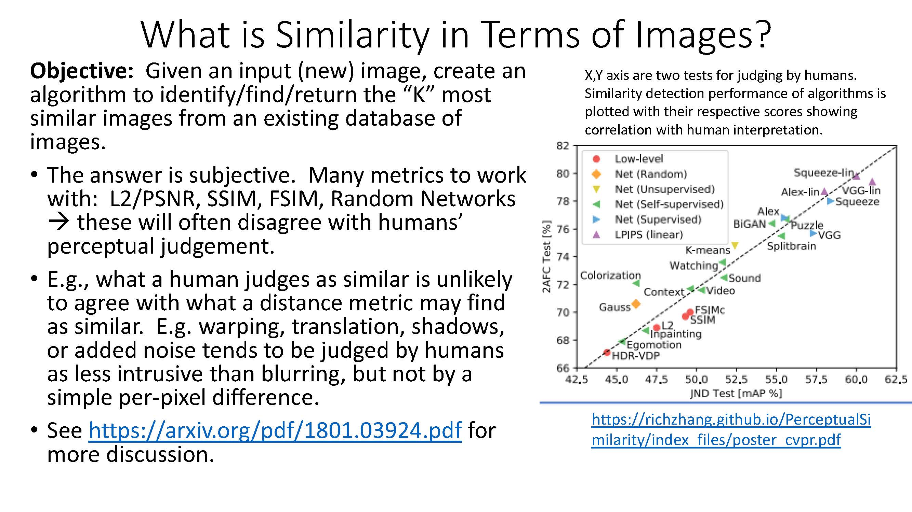
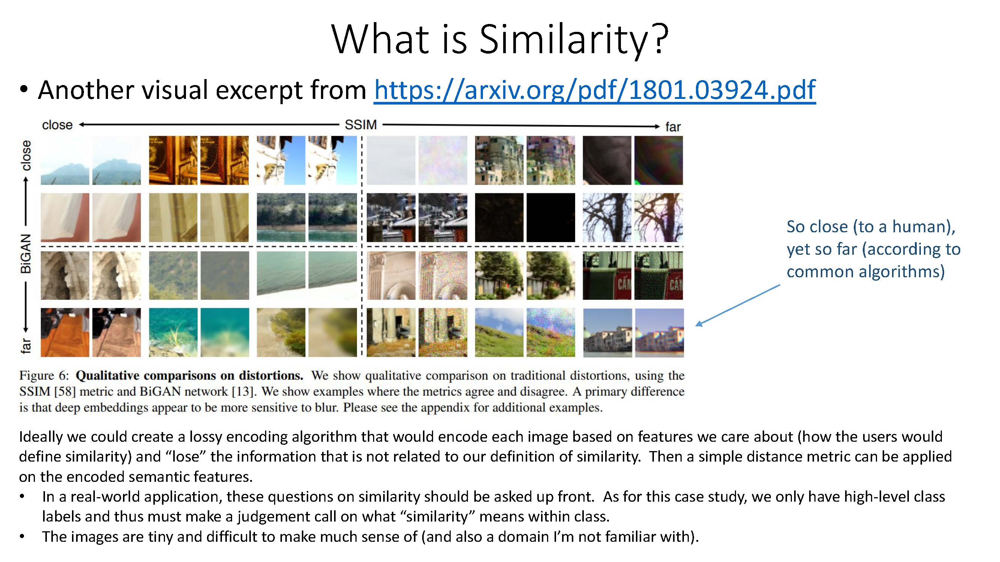

Geological Image Similarity BACKGROUND A geology research company wants to create a tool for identifying interesting patterns in their imagery data. This tool will possess a search capability whereby an analyst provides an image of interest and is presented with other images which are similar to it. GOAL Your task is to create the machine learning component for this image similarity application. The machine learning model should return the top K images that are most similar to this image based on a single image input. DATA Please send a document displaying your code and thought process to your recruiter at least 24 hours prior to your interview. Download link: http://aws-proserve-data-science.s3.amazonaws.com/geological_similarity.zip

# Case Study -- Bank Marketing Capaign Data Analysis

  

  

  

  

  

  

